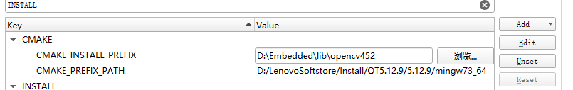

# 嵌入式人脸识别项目

## 一、功能分析

### 1.客户端


### 2.服务器


## 二、环境搭建

### 1.cmake安装

用来编译opencv

3.24.1

https://github.com/Kitware/CMake/releases

### 2.Opencv4.5.2和第三方库

https://opencv.org/releases/

https://github.com/opencv/opencv_contrib/tags

编译opencv

- qt中为构建工具添加cmake
- 打开opencv下的CMakeLists.txt文件
- 设置安装路径



- 添加opencv_contrib-4.5.2依赖库中的face目录


### 3.seetface6下载


## 三、opencv和seetface测试

```c
1.新建qt项目
2.导入
    #include <opencv.hpp>
    #include <FaceDetector.h>
3.为项目指定包的路径
    INCLUDEPATH += D:\Embedded\lib\opencv452\include
    INCLUDEPATH += D:\Embedded\lib\opencv452\include\opencv2
    INCLUDEPATH += D:\Embedded\lib\SeetaFace\include
    INCLUDEPATH += D:\Embedded\lib\SeetaFace\include\seeta
4.添加库路径
    LIBS += D:\Embedded\lib\opencv452\x64\mingw\lib\libopencv*
    LIBS += D:\Embedded\lib\SeetaFace\lib\libSeeta*
5.添加环境变量
    第一种方法：电脑环境变量->path->增加opencv和seetface的bin路径
    第二种方法：qt->项目
```


## 四、客户端界面UI


## 五、客户端实现

### 1.摄像头相关

```c
1.将摄像头显示到videolb上（QLabel）
/* 1.打开摄像头
 * 定义 VideoCapture cap
 * 打开摄像头：cap.open(0); /dev/video*
 */  
2.采集图像
使用定时器，采集图像 void timerEvent(QTimerEvent *e); 打开定时器startTimer(100);
Mat srcImage;
if (cap.grab())
{
	cap.read(srcImage);
}
3.转换格式：opencv直接采集到的图像数据是BGR格式，并且需要将Mat格式转换为QT认识的QImage格式
cvtColor(srcImage, srcImage, COLOR_BGR2RGB);
QImage image(srcImage.data, srcImage.cols, srcImage.rows, srcImage.step1(), QImage::Format_RGB888);
4.显示图像
QPixmap mmp = QPixmap::fromImage(image);
ui->videolb->setPixmap(mmp);
```

### 2.级联分类器

功能：实现人脸位置的检测

```c
1.定义级联分类器
cv::CascadeClassifier cascade;
2.导入级联分类器
cascade.load("D:/Embedded/lib/opencv452/etc/haarcascades/haarcascade_frontalface_alt2.xml");
3.检测并存储脸部位置数据，先将原始图像转换为灰度图像
Mat grayImage;
cvtColor(srcImage, grayImage, COLOR_BGR2GRAY);
std::vector<Rect> faceRects;
cascade.detectMultiScale(grayImage,faceRects);
4.将检测框绘制到图像上
Rect rect = faceRects.at(0);
rectangle(srcImage,rect,Scalar(0,0,255));

```

### 3.Tcp上传服务器

功能：客户端采集到的图像数据通过TCP上传给服务器

```c
1.连接服务器实现断线重新连接
/* 创建网络套接字*/          
QTcpSocket *msocket;  
QTimer mtimer;        
/* 定时器连接服务器*/                                                                     
connect(&mtimer, &QTimer::timeout, this, &FaceAttendence::timer_connect);         
mtimer.start(1000);                                                               
                                                                                  
/* 实现断线重新连接*/                                                                     
msocket = new QTcpSocket(this);                                                   
connect(msocket, &QTcpSocket::disconnected, this, &FaceAttendence::start_connect);
connect(msocket, &QTcpSocket::connected, this, &FaceAttendence::stop_connect);
void FaceAttendence::stop_connect()
{
    mtimer.stop();
    qDebug()<<"连接成功";
}

void FaceAttendence::start_connect()
{
    mtimer.start(5000);
    qDebug()<<"断开连接";
}

void FaceAttendence::timer_connect()
{
    /* 连接服务器*/
    msocket->connectToHost("127.0.0.1", 8888);
    qDebug()<<"正在连接服务器"<<msocket->state();
}
```

```c
2.将采集到的图像传给服务器端显示
新建服务器端工程
/* TCP服务器*/          
QTcpServer mserver;  
QTcpSocket *msocket; 
quint64 bsize;       
/* 客户端连接槽函数*/                                                                             
connect(&mserver, &QTcpServer::newConnection, this, &FaceAttendanceServer::accept_client);
mserver.listen(QHostAddress::Any, 8888);                                                  
bsize = 0;

void FaceAttendanceServer::accept_client()
{
    msocket = mserver.nextPendingConnection();
    // 关联接收函数
    connect(msocket, &QTcpSocket::readyRead, this, &FaceAttendanceServer::read_data);
}
void FaceAttendanceServer::read_data()
{
    // 读取数据
    QDataStream stream(msocket);
    stream.setVersion(QDataStream::Qt_4_1);
    if (bsize == 0)
    {
        if (msocket->bytesAvailable() < (qint64)sizeof(bsize)) return;
        stream >> bsize;
    }

    if (msocket->bytesAvailable() < bsize) return;

    QByteArray data;
    stream >> data;
    bsize = 0;
    if (data.size() == 0) return;
    //显示图片
    QPixmap mmp;
    mmp.loadFromData(data, ".jpg");
    mmp = mmp.scaled(ui->videoLB->size());
    ui->videoLB->setPixmap(mmp);
}
```


## 六、服务器端实现

### 1.人脸识别模块的封装（注册和查询）

- 新建C++类模块
- 添加库路径
- 人脸数据存储
- 人脸检测
- 人脸识别（seetface库）

### 2.服务器数据库设计

- 员工信息表和考勤表

### 3.服务器界面设计


### 4.信息录入到数据库

### 5.摄像头

